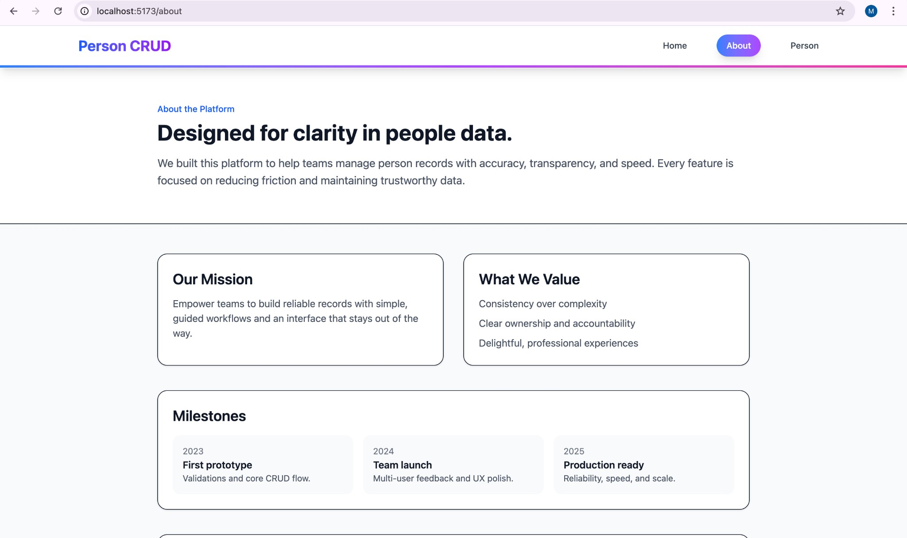
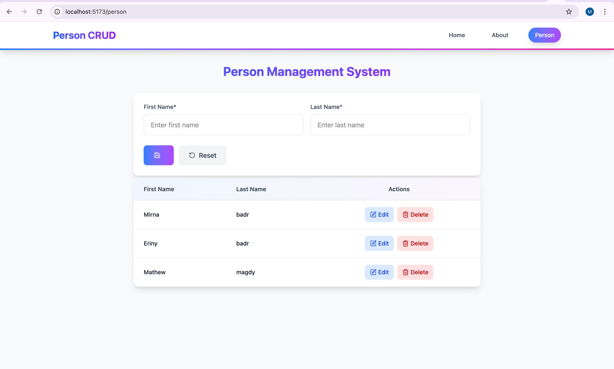

## Person CRUD — .NET + React

Full-stack Person Management system with a .NET Web API and a React (Vite) client. 
The API exposes clean CRUD endpoints, uses Entity Framework Core with SQLite, and is CORS-ready for local dev. 
The client provides a professional UI with responsive layouts, validation, and toast feedback.

### Highlights
- Full CRUD: create, read, update, delete person records
- .NET Web API + EF Core (SQLite) with migrations
- React + Vite frontend, Tailwind styling, and polished UI
- Clean UX: form validation, loading states, and notifications
- Ready for deployment and extension

### Tech Stack
- Backend: .NET 9, ASP.NET Core Web API, EF Core, SQLite
- Frontend: React, Vite, Tailwind CSS, React Hook Form, Axios
- Tooling: ESLint, Hot Toast

### Screenshots




### Project Structure
- `Backend/` - .NET Web API, EF Core models, migrations
- `client/` - React frontend
- `docs/screenshots/` - UI screenshots

### Getting Started
#### Backend
```bash
cd Backend
dotnet restore
dotnet run
```
The API runs on `http://localhost:3000` by default.

#### Frontend
```bash
cd client
npm install
npm run dev
```
The app runs on `http://localhost:5173`.

### API Overview
Base URL: `http://localhost:3000`

Key endpoints:
- `GET /people`
- `GET /people/{id}`
- `POST /people`
- `PUT /people/{id}`
- `DELETE /people/{id}`

### Roadmap Ideas
- Pagination and search filters
- Authentication and role-based access
- Dockerized deployment

### License
MIT
